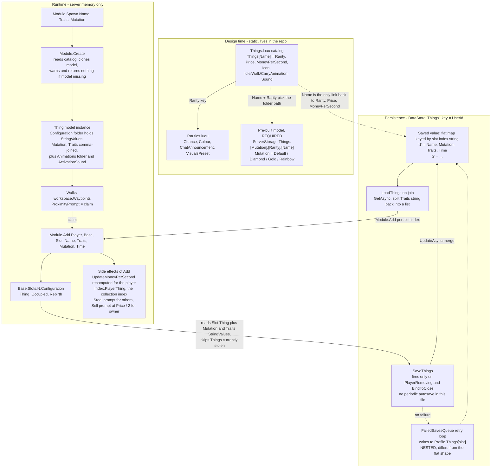

# 007 — Existing `Thing` schema and persistence

**Date:** 2026-09-23
**Status:** findings only. Everything here is from **reading** the template
code, none of it was run. No PC-to-Thing projection has been decided yet.

## Why this exists

Direction chosen in chat: a fully repaired `PCUnit` gets "promoted" into a
regular `Thing` and rides the template's existing placement, income and save
path, instead of us building a parallel one. Before designing that projection
we needed the real schema. Sources:
[`Things.luau` (config)](../src/ReplicatedStorage/Configuration/Modules/Things.luau),
[`Things.luau` (runtime)](../src/ServerStorage/Modules/Things.luau),
[`Things.server.luau`](../src/ServerScriptService/Things.server.luau).

## Diagram

## Schemas

**Catalog entry** (`Things.Things[Name]`): every entry has the same 8 fields,
checked across Common/Rare/Epic: `Rarity`, `Price`, `MoneyPerSecond`, `Icon`,
`IdleAnimation`, `WalkAnimation`, `CarryAnimation`, `Sound`. Only
Common/Rare/Epic are actually used by the catalog today, even though
`Rarities.luau` defines more tiers.

**Persisted per-slot record:** `{ Name, Mutation, Traits, Time }`. `Traits` is
a comma-joined string. Nothing else survives a rejoin: rarity, price,
income, animations are all re-derived from the catalog via `Name`.

## Findings worth knowing

1. **A real model must exist** at `ServerStorage.Things.<Mutation>.<Rarity>.<Name>`
   or `Module.Create` just `warn()`s and returns nothing. Promotion of a PC
   into a Thing cannot be exercised end to end without at least one such model.
2. **Steal already exists** on placed Things (`Module.Add` gives every
   placed Thing a Steal prompt for other players). It is a different mechanic
   from our sabotage, which is pre-repair and on the conveyor. A promoted PC
   would inherit steal-vulnerability automatically.
3. **No periodic autosave** in `Things.server.luau`: `SaveThings` is only
   called from `PlayerRemoving` and `BindToClose`. A server crash loses
   everything placed since the player joined.
4. **Retry-queue shape mismatch (looks like a template bug):** the normal
   save writes a flat `{["1"]=..., ["2"]=...}`, but the `FailedSavesQueue`
   retry path writes into `Profile.Things[slot]`, a nested table. `LoadThings`
   iterates the flat shape, so retried data is likely never loaded, and the
   next normal `SaveThings` will delete the stray `Things` key. Static read
   only, not reproduced.
5. **`Time` is effectively vestigial in the save path:** `SaveThings` writes
   `oldSlotTime or 0`, so it never advances. It is still passed through to
   `Module.Add` on load.
6. **`Traits` is not a free-form metadata field.** `Insert.Thing`
   (`src/ServerStorage/Modules/Insert/init.luau`) looks each trait name up in
   the Traits config: known names add a `Multiplier` to income and show a
   GUI element, unknown names are silently ignored. Don't smuggle PC data
   into it. Also, the on-screen name is just `Thing.Name` (no separate
   display-name field in the catalog), so a catalog `Name` doubles as what
   players read.

## Implication for the PC to Thing projection

- Part composition and tiers do **not** persist through a Thing. Once
  promoted, only `Name` (plus `Mutation`/`Traits`) survives, which matches
  the "`PCUnit` is a discarded staging record" direction. If per-PC detail
  ever needs to survive, it has to be encoded in `Name` or `Traits`.
- Leading option (not decided): several new catalog `Name`s, one per tier
  (`RepairedPC_Common`, `RepairedPC_Rare`, ...), `Mutation` left as
  `"Default"`. `Mutation` means "skin variant"; overloading it as an
  economic tier would blur two separate concepts.
- Open, not decided: how many tiers, how a `PCUnit`'s part tiers aggregate
  into one, and what to do with the now-unused income-freeze math in
  `PCUnit.completeRepair` / `IncomeMultipliers.luau` (left in place for now).
